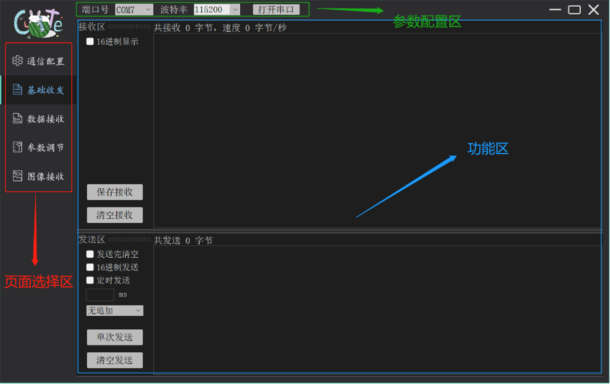
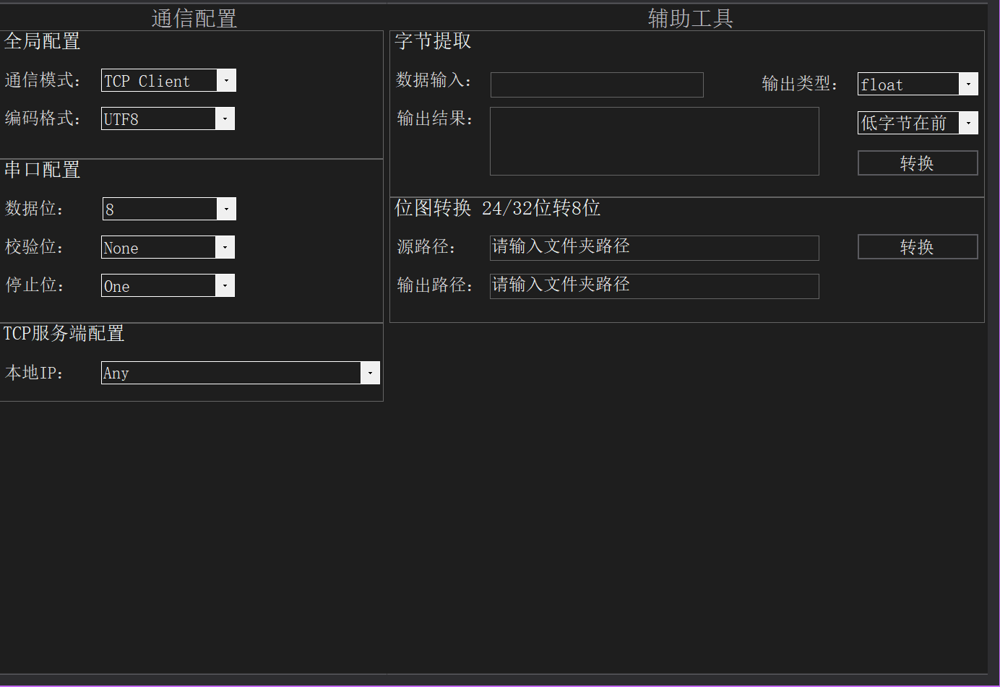
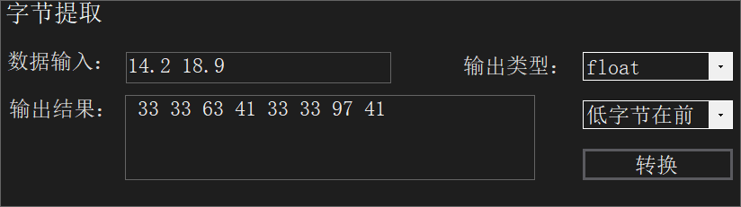
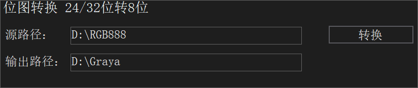
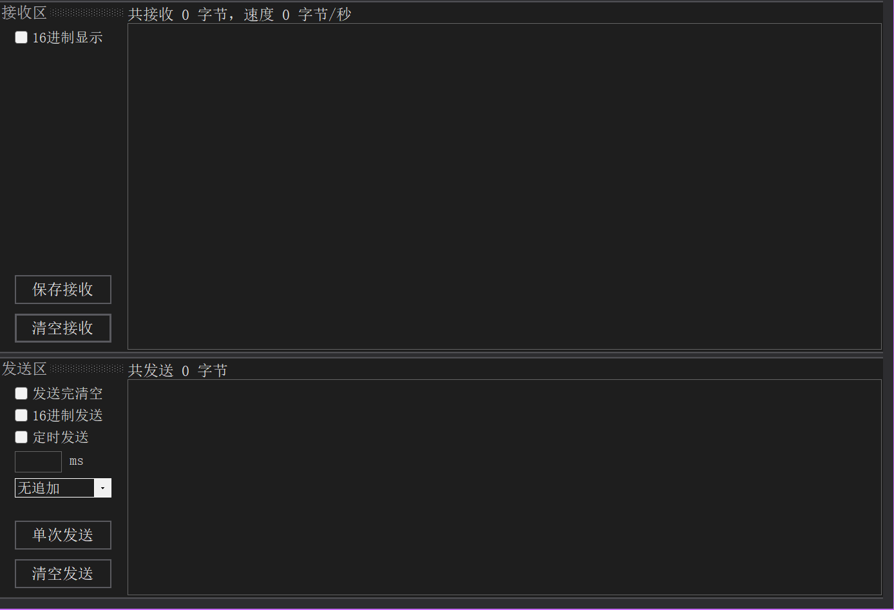
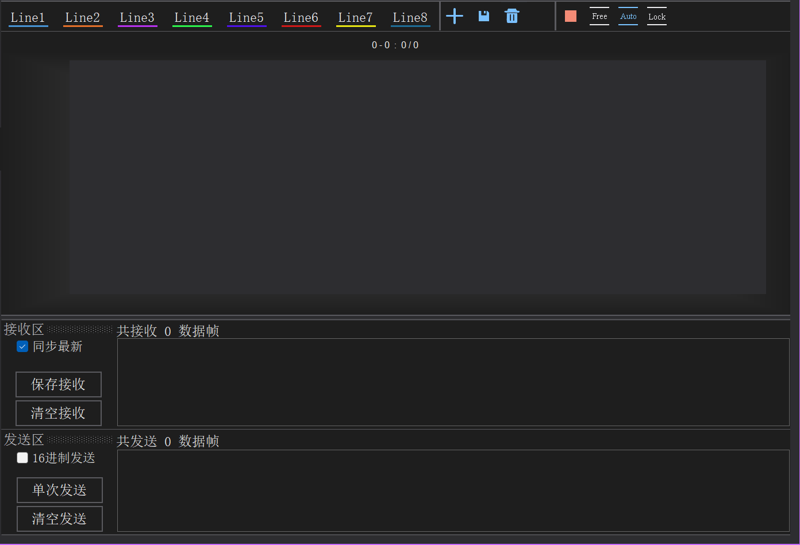
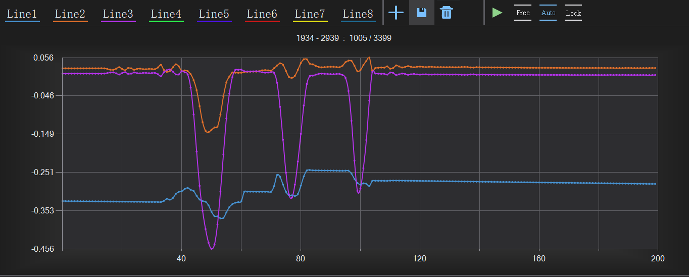
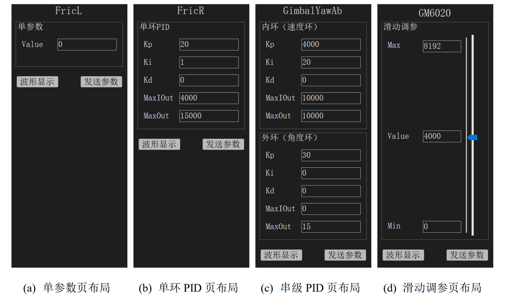
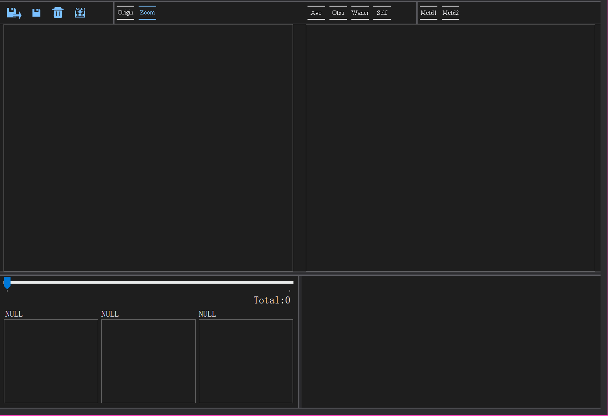
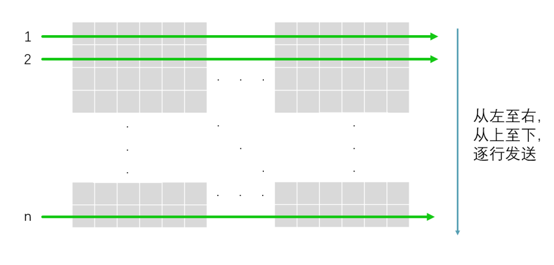

# 修订记录

**1.0.1** 参数调节页面，切换、单击参数时自动全选

**1.0.2** 删除初始化加载颜色界面

**1.0.3** 解决关闭软件时会弹出错误窗格

**1.0.4** 波形显示优化，速度提升；功能区随大小变化而修正

**1.0.5** 修复波形不同缩放下平移出错bug

**1.0.6** 数据接收文本框持续更新

**1.0.7** 优化存储；波形添加缩放倍数上限；优化子页面最大化显示

**1.0.8** 图像收发添加动态编译

**1.1.1** 串口通信优化；软件开启速度提升

**1.1.2** 数据接收添加数据全部显示功能

**1.1.3** 图像接收协议规整

**1.1.4** 波形显示子页面数据同步主页面

**1.1.5** 通信配置页面等比缩放

**1.1.6** 波形子页面修复坐标轴bug，列表浅表复制，节约空间

**1.1.7** TCP协议优化，加入离线识别

**1.2.1** UI优化；调参子页面加入大小自适应

**1.2.2** 桌面logo更新

**1.2.3** 优化图像传输协议

**1.2.4** 参数调节可直接切换不同参数间的波形显示；波形页面当数据个数切换时自动清空原有数据

**1.2.5** 修复波形显示错误

**1.2.6** 修复波形显示文本行跳转错误

**1.2.7** 清空波形显示将初始化波形区状态

**1.2.8** 修复参数调节页面波形区显示bug

**1.2.9** 更新Readme二值化传图example


---

# 使用说明

## 1. 概述

软件整体风格为黑色简约，因支持串口通信以及LAN通信，配置信息较多。为了提高界面的使用率、减少视觉感官压力、使上位机的操作变得简单舒适，该上位机将重要参数或者需频繁更改的系统参数置于上方明显位置，不常更改的参数则都放置于通信配置界面中。当界面的大小改变时，页面选择区的宽度和参数配置区的高度不会发生改变，而会使增长的空间全部提供给功能区使用。子页面的自制按键加入了悬停提示小窗，方便用户使用。

本文上位机界面分为三个区域：页面选择区、功能区以及常用参数配置区。因支持功能多同时需保证可拓展性，该软件按照功能的不同设计了一个配置页面和四个功能页面共五个子页面，分别为通信配置页面、基础收发页面、数据接收页面以及图像接收页面。各子页面共享功能区，子页面间的切换通过点击页面选择区的对应按钮实现，切换时会有过渡动画以及左侧方形指示条进行提示。页面布局如下图所示。



## 2. 参数配置界面

### 串口配置


- 串口配置中，需配置端口号、波特率。其他配置信息默认为数据位8位，校验位0位，停止位1位，可在通信配置页面中更改。当串口打开后，打开串口按钮字样将显示为“关闭串口”。在更改串口配置信息前需关闭串口否则更改无效。 

串口号下拉列表每下拉一次刷新一次本地串口号。如若修改串口配置需重启串口。

### 局域网配置


LAN配置包括三种类型，分别为**TCP服务端**，**TCP客户端**，**UDP**配置。

- TCP 服务端需配置本地IP、远程IP（可选）、通信端口号。本地IP默认选择为所有本地IP地址，可在通信配置页面中更改。当服务端发送数据时如Remote IP一栏为空则以广播通信方式发送给所有加入该服务器的客户端IP地址，如果不为空则以点对点通信方式发送给用户设置的客户端IP地址。每当客户端加入服务器时，会自动将其IP地址加入Remote IP下拉列表中，用户可随时更改（无需关闭连接）。通信端口号即为服务器开启时所用的端口号。

- TCP客户端需配置远程IP、通信端口号。远程IP即需加入服务器的IP地址，端口号即需加入服务器所用的端口号。
- UDP通信需配置远程IP、本地端口号，远程端口号。远程IP即通信对方的本地IP地址。因页面大小有限，所以本地端口号和远程端口号共用Port一栏。打开连接前Port代表本地端口号，打开连接成功后，此时可更改Port号为远程端口号（无需关闭连接）。

LAN配置中，除上文强调可在连接未关闭的前提下更改的配置信息外，其余配置信息更改前需关闭连接，否则更改无效。

## 3. 通信配置界面



### 通信配置

**全局配置**包括通信模式与编码格式配置：

- **通信模式**：指上位机与下位机间的通信方式，本文调试软件支持串口通信与局域网通信。当通信模式在两者之前切换时，参数配置区会切换成与之对应的样式。
- **编码格式**：指数据源的解码格式以及发送数据时的编码格式，默认设置为UTF8格式。

**串口配置**根据串口需要进行设置，设置完成后需重启串口方能生效。

**TCP服务端配置**：

- **本地IP**：当开启TCP服务端时生效，默认为“Any"。每当本地IP下拉列表展开时，会自动查询所有本地IP地址，用户可自行选择。其中“Any”代表选择所有本地IP地址。

### 辅助工具

- **字节提取**：该功能为提取一个或多个数据的字节并以16进制的方式显示。

使用方法：输入一个或多个数据，数据间通过空格或逗号间隔，配置好相应的数据类型与输出格式，点击转换即可。



常用案例：**浮点型字节显示**、**通信协议数据的确认**等。


- **位图转换**：该功能为将rgb格式或者argb格式的图片转换为灰度图片即深度为8位的图片。

使用方法：在源路径文本框中输入需要转换的图片所在文件夹，在输出路径文本框中输入灰度图片所在文件夹，点击转换即可。



常用案例：**图片格式统一**等。

## 4. 基础收发页面

基础收发页面会原生态的显示和发送数据，而不会对数据进行包装或加密处理。



### 接收区

接收区包含三个功能：16进制显示、保存接收、清空接收。

- **16进制显示**：选择框被勾选后，当与下位机建立连接时，接收区文本框会保留历史显示，新接收数据按照16进制进行显示；当与下位机的连接断开时，接收区文本框则清空显示并将缓存数据转换为16进制进行显示。（**不要在数据高速传输的时候切换**，不然会卡死你）
- **保存接收**：将当前缓存数据按照一定格式保存在文本文档中。根据16进制显示选择框状态从而决定按照文本形式或者16进制形式进行保存。
- **清空接收**：清空缓存数据、接收区文本框显示以及接收统计数据。

### 发送区

发送区包含七个功能：发送完清空、16进制发送、定时发送、发送队列追加、单次发送、清空发送以及发送历史回溯。

- **发送完清空**：发送完清空选择框被勾选后，发送区文本框内容送入发送队列后将清空文本框内容。

- **16进制发送**：16进制发送选择框被勾选后，文本框输入内容将按照16进制解析后送入发送队列，数据间通过空格或逗号分隔。
-  **定时发送**：定时发送文本框被勾选后，将按照设定时间间隔发送文本框内数据，同时会检测文本框内数据长度。如果设定时间间隔内不足以发送完文本框内容或者未设置设定发送间隔时间，将自动重新设置最小发送间隔（最小值：1ms）。
- **发送队列追加**：将文本框的数据与选择的追加内容一起送至发送队列中。
- **单次发送**：将文本框内的内容送入发送队列。如果发送成功发送内容将被保存在历史发送记录中。
- **清空发送**：清空历史数据、发送区文本框显示内容以及发送数据统计。
- **发送历史回溯**：通过键盘Up和Down键查询并切换，默认保存50条历史发送数据，可通过修改执行文件路径下SendHistory.xml文件。

## 5. 数据接收页面

数据接收页面将按照固定协议发送和接收数据，同时支持最多8个数据的波形显示以及文本显示。。该页面划分为波形显示区域（以下简称波形区）和文本显示区域（以下简称文本区），波形区包括功能区和显示区，功能区居上，显示区靠下。显示区横轴（X轴）表示数据点个数，竖轴（Y轴）表示接收到数据的大小。显示区标题格式为：显示起始帧数-显示末尾帧数:显示范围/总接收帧数。

**注**：当接收数据帧数据个数发生变化时，将会自动清空原有数据并重新显示当个数据。



### 波形区

波形显示区共包含十一个主要功能：波形线显示、波形显示页面添加、数据存储、数据清空、X轴显示模式设置、Y轴显示模式设置、文本接收区显示数据跳转、数据标签显示、鼠标缩放、鼠标数据拖动以及范围数据全部显示。

- **波形线显示**：如上图中的Line1-Line8按钮。通过单击按钮显示或关闭对应波形线，如果波形数据个数不为零。下方的颜色线条将指示是否允许波形线显示。

- **波形显示页面添加**：单击按钮新建一个新的波形页面。新增的页面与主波形显示页面数据共享且相同但功能独立。

- **数据存储**：按照固定格式将所有数据存入文本中。

- **数据清空**：清空历史数据、波形显示图、接收区中的文本显示以及接收数据统计。

- **X轴显示模式设置**：当图标为红色方形块时，即为数据自动更新模式，波形图将自动更新显示最新数据；当图标为绿色三角形时，即为数据非自动更新模式，波形图将维持当前显示直到有新的控制指令传入。

- **Y轴显示模式设置**：

> **Free模式**：Y轴的显示范围由用户通过鼠标滚轮控制。
>
> **Auto模式**：Y轴的显示范围由历史极值与当前显示数据范围的极值共同决定。
> $$
> Y_{max}=max\left\{Y_{max},{\,\,} \overset{\pmb{max}}{x_{min}\leq x\leq x_{max}}Y_x \right\}
> 
> \tag{式1}
> $$
>
> $$
> Y_{min}=min\left\{Y_{min},{\,\,} \overset{\pmb{min}}{x_{min}\leq x\leq x_{max}}Y_x \right\}
> \tag{式2}
> $$
>
> **Lock模式**：Y轴的显示范围仅由当前显示数据范围的极值决定。
> $$
> Y_{max}=\overset{\pmb{max}}{x_{min}\leq x\leq x_{max}}Y_x
> \tag{式3}
> $$
>
> $$
> Y_{min}=\overset{\pmb{min}}{x_{min}\leq x\leq x_{max}}Y_x
> \tag{式4}
> $$

- **数据跳转**：鼠标左键点击波形区域即可实现文本区中文本跳转到指定数据进行显示。

- **数据标签显示**：当鼠标悬停在波形线上时即可显示数据标签。

- **数据拖动**：鼠标左键点击波形区并按住，此时波形可随鼠标的移动而移动。当鼠标移动后导致数据显示范围非最新，此时X轴显示模式将自动切换成数据不自动更新模式。当Y轴为Free模式时，波形可以随鼠标上下移动；当Y轴为Auto模式时，波形会随鼠标的移动而缩小；当Y轴为Lock模式时，Y轴显示范围不由鼠标控制。

- **鼠标缩放**：鼠标滚轮滚动将缩放X、Y轴的显示范围，当X轴的显示点数范围大于设定最大显示点数时，将间隔取点显示。当Y轴显示模式处于Auto模式时会自动切换成Free模式。

- **范围数据全部显示**：鼠标右键波形界面，会出现“全部显示”或“间隔显示”字样，点击后即可切换。

> **全部显示**：显示范围内数据点不再间隔显示，转而为显示所有点，同时波形线将不再标注点。
>
> **间隔显示**：显示范围如果大于200个点，将等距间隔取点。同时波形线会标注出每个点的位置。

波形区显示效果如下图所示：



如上图标题显示以及标题格式说明可知：当前数据显示范围为1934-2939个数据帧，共1005个数据帧，总共接收3399个数据帧。

**常规操作如下**：

1. 先滑动滚轮缩放坐标轴至数据范围合适，如下位机发送频率为100Hz，我需要显示1s的数据范围，即可将范围缩放至1000个数据点附近。
2. 切换至**Lock**模式，锁定Y轴范围。
3. 切换至**Auto**模式，使Y轴范围自动放大。
4. 如若查看历史数据，只需鼠标拖动即可。

### 文本区

文本区包含接收区与发送区。

接收区文本框按照一定数据格式进行显示，其中每一行代表一帧数据。

- **同步最新**：选择后，接收区文本框显示数据为接收最新数据，即波形区中波形线末尾数据。
- **数据翻阅**：当鼠标滚轮在接收区文本框滚动时，会关闭同步最新功能并根据鼠标操作翻阅数据，翻阅速度与波形区X轴缩放比例相关。

文本区其余功能同基础收发页面。

## 6. 参数调节页面

参数调节页面分为三个区域，按键交互区、标题区和调参区。按键交互区和标题区位于大小可调面板容器的一栏，调参区位于另一栏。每个参数子页面的标题汇总显示在标题区中。所有标题由上至下，由左到右排列放置。当标题前选择框被勾选时，对应的子页面由左向右推入调参区。

按键交互区共有两个交互按键，功能分别为添加子参数页和从下位机导入参数页。

- **添加子参数页**：用户可在弹出的参数添加窗口中添加子参数页并设置其相关配置。新子参数页的标题将会添加至标题区队列末尾。
- **下位机导入参数页**：上位机将发送起始帧，此时上位机接收到的数据都将被解析为参数页初始数据直至接收到下位机发送的结束帧，同时解析后的参数页标题将被添加至标题区中。

子参数页的类型共有四种，分别为单参数、单环PID、串级PID和滑动调参。子参数页的标题靠顶部居中显示。子页面布局如下图所示：



每个子参数页都包含波形显示和发送参数功能。

- **波形显示**：向下位机发送波形显示起始帧，同时开启一个波形显示窗口，该窗口即数据接收页面的波形显示区。关闭波形显示窗口则会发送波形显示结束帧。
- **发送参数**：将子页面中的参数制作成参数帧并发送给下位机，同时接收下位机的回传参数帧进行校验。如果发送数据帧与接收数据帧相同，则会在发送参数按钮旁显示OK绿色字样以提示用户下位机接收成功。

在滑动调参页面中，每当滑动条滑动块位置改变时都会发送当前参数，同时也可点击发送参数按钮发送参数。其余类型参数页都需点击发送参数按钮方能发送参数。

## 7. 图像接收页面

图像接收页面分为两栏上下放置，上栏为图片处理区，下栏又左右分成两栏分别为图片汇总区和调试输出区。图片处理区最上方为自制按键，包含了多种图像处理算法等功能，按键下方左右对称放置两个显示图像的控件，左边为原始图片显示，右边为处理后图像显示。。图片汇总区共有三个图像显示控件以及一个滑动条控件，图像显示控件默认以缩放模式显示图片。当图像接收页面大小变化时，页面上下栏的相对大小、上栏按键区域高度以及下栏图片汇总区域高度不发生改变。调试输出区仅由一个文本框构成，用以图像处理算法中调试信息的显示以及编译信息的打印。



图片处理区包含八个功能，分别为图片导入、图片保存、图片清空、代码编译、图片显示模式、图片预处理方法、图片识别方法以及像素点信息显示。

-  **图片导入**：从文件夹中导入任意大小、任意数量的图片。导入成功或失败都会显示提示窗口。

- **图片保存**：将缓存区中的原始图片存储至文件夹中。

- **图片清空**：清空缓存区中的所有图片，清空各个分区的显示。

- **代码编译**：自定义预处理算法、识别算法代码编译。代码文件为cs格式，且需与可执行程序同一路径。编译信息会在调试输出区显示，编译成功后图片重新计算并更新显示。

- **图片显示模式**：分为原始模式与缩放模式，默认为缩放模式。

> **原始模式**：图片将按原始分辨率居中显示。
>
> **缩放模式**：图片将自适应窗口大小，以固定长宽比进行缩放显示。

- **图片预处理方法**：分为均值法二值化、大津法二值化、Wellner自适应二值化和用户自定义算法，默认不选择。

- **图片识别方法**：分为边界识别和自定义识别，默认不选择。

- **像素点信息显示**：当鼠标左键点击图片时，会以鼠标点击处为原点，靠近图片中心的位置显示鼠标点击坐标以及像素点值。

预处理方法和图片识别方法用户分别最多可以选择一个算法参与图片计算。当算法切换时，图片会重新计算并更新显示。

图片汇总区会保存历史图片，三个图形控件可以预览当前选择图片附近的三张图片。用户可以通过移动滑动条、点击图形控件、按下左右按键来切换图片。如果当前显示的图片非缓冲区末尾图片，那么即使有图片接收也不会自动切换图片。

------

# 通信协议

为方便软件对不同通信协议进行解包，上下位机间的通信协议格式基本类似。总共分为三种协议：数据传输协议、参数传输协议、图像传输协议。

**上下位机通信协议格式**：

| 帧头(n-byte) | 数据(n-byte) | 帧尾(1-byte)（固定为0x29） |
| :----------: | :----------: | :------------------------: |


## 1. 数据传输协议

数据传输协议中单帧只能传输同一种类型数据，命令码对应的传输类型如命令码说明表所示。数据按低字节在前进行传输。

**帧头格式(共3-byte)**：

| 帧起始字节 | 命令码 | 数据个数 |
| :--------: | :----: | :------: |
|   1-byte   | 1-byte |  1-byte  |

**帧头详细定义**：

|     域     | 偏移位置 | 大小（字节） |              详细描述              |
| :--------: | :------: | :----------: | :--------------------------------: |
| 帧起始字节 |    0     |      1       |            固定值为0x28            |
|   命令码   |    1     |      1       |         用以区分协议、功能         |
|  数据个数  |    2     |      1       | 帧中数据个数n，应满足{0 <= n <=8 } |

**命令码说明**：

| 命令码 |   协议类型   |     功能说明     |
| :----: | :----------: | :--------------: |
|  0x01  | 数据传输协议 | 数据为uint8类型  |
|  0x02  | 数据传输协议 | 数据为uint16类型 |
|  0x04  | 数据传输协议 | 数据为uint32类型 |
|  0x09  | 数据传输协议 |  数据为int8类型  |
|  0x0a  | 数据传输协议 | 数据为int16类型  |
|  0x0c  | 数据传输协议 | 数据为int32类型  |
|  0x0f  | 数据传输协议 | 数据为float类型  |

**命令码规则表**：

|  bit  |                功能                |
| :---: | :--------------------------------: |
| [0:2] |          value表示字节数           |
|  [3]  |   置1为有符号型，置0表示无符号型   |
| [0:3] | （special）全部置1表示单精度浮点型 |
| [4:7] |              全部置0               |

**数据段格式**：

|  data  |  …   |  data  |
| :----: | :--: | :----: |
| n-byte |  …   | n-byte |

## 2. 参数传输协议

**帧头格式(共4-byte)**：

| 帧起始字节 | 命令码 | 命名长度 | 参数个数 |
| :--------: | :----: | :------: | :------: |
|   1-byte   | 1-byte |  1-byte  |  1-byte  |

**帧头详细定义**：

|     域     | 偏移位置 | 大小（字节） |      详细描述      |
| :--------: | :------: | :----------: | :----------------: |
| 帧起始字节 |    0     |      1       |    固定值为0x28    |
|   命令码   |    1     |      1       | 用以区分协议、功能 |
|  命名长度  |    2     |      1       |    帧中名字长度    |
|  参数个数  |    3     |      1       |    帧中参数个数    |

上表中参数个数**n**，应满足**n=1,3,5,10**.

**命令码说明**：

| 命令码 |   协议类型   |    功能说明     |
| :----: | :----------: | :-------------: |
|  0x10  | 参数传输协议 | 参数为float类型 |

**数据段格式**：

|  名字  |  参数  |
| :----: | :----: |
| n-byte | n-byte |

**名字格式**：

西文格式，大小任意但需固定。

**参数格式**：

|  data  |  …   |  data  |
| :----: | :--: | :----: |
| 4-byte |  …   | 4-byte |

单个参数默认为float型，即大小为4字节。参数的总大小由参数个数决定。参数个数与参数的对应关系如下表所示。

**参数意义说明**：

| 参数个数 | 参数页类型 |                          各参数意义                          |
| :------: | :--------: | :----------------------------------------------------------: |
|    1     |  单参数页  |                              无                              |
|    3     | 滑动调参页 |     依次为滑动条的最大值，滑动条的当前值，滑动条的最小值     |
|    5     | 单环PID页  | 依次为单环PID系统中的比例系数，积分系数，微分系数，最大积分输出，最大输出 |
|    10    | 串级PID页  | 依次为串级PID系统中内环的比例系数，积分系数，微分系数，最大积分输出，最大输出；外环的比例系数，积分系数，微分系数，最大积分输出，最大输出 |

其中滑动调参页中各参数皆为**整型**，滑动条间隔大小为**1**。

下位机导入参数功能：起始帧和结束帧中数据长度为0，名字为“LOAD_START”，即点击按钮后上位机会发送一帧名为“LOAD_START”、数据长度为0的起始帧，此时上位机接收到的所有帧都会被识别成新的参数帧保留在页面中，直至接收到下位机发送的名为“LOAD_START”、数据长度为0的结束帧，方能进入正常调参模式。

## 3. 图像传输协议

**帧头格式(共7-byte)**：

| 帧起始字节 | 命令码 |  宽度  |  高度  | 帧头校验 |
| :--------: | :----: | :----: | :----: | :------: |
|   1-byte   | 1-byte | 2-byte | 2-byte |  1-byte  |

**帧头详细定义**：

|     域     | 偏移位置 | 大小（字节） |      详细描述      |
| :--------: | :------: | :----------: | :----------------: |
| 帧起始字节 |    0     |      1       |    固定值为0x28    |
|   命令码   |    1     |      1       | 用以区分协议、功能 |
|    宽度    |    2     |      2       |  帧中图像宽度大小  |
|    高度    |    4     |      2       |  帧中图像高度大小  |
|  帧头校验  |    6     |      1       |    固定值为0x2D    |

**命令码详细说明**：

| 命令码 |   协议类型   |    功能说明    |
| :----: | :----------: | :------------: |
|  0x21  | 图像传输协议 | 二值化图像格式 |
|  0x22  | 图像传输协议 |  灰度图像格式  |
|  0x23  | 图像传输协议 | RGB565图像格式 |
|  0x24  | 图像传输协议 | RGB888图像格式 |

**数据段格式**：

| Pixel  |  …   | Pixel  |
| :----: | :--: | :----: |
| n-byte |  …   | n-byte |

**数据段详细说明**：

|  传输模式  |                          数据段格式                          |
| :--------: | :----------------------------------------------------------: |
|  二值传输  | 按位表示每个像素点，低位先装载像素点，即[7:0]代表像素点[n:n-7]，不足一个字节的按0补齐。 |
|  灰度传输  |                   每个字节代表一个像素点。                   |
| RGB565传输 | 两个字节代表一个像素点，高字节在前。[15:11]代表R，[10:5]代表G，[4:0]代表B。 |
| RGB888传输 | 三个字节代表一个像素点，高字节在前。[31:0]每8位依次代表R，G，B。 |

图像需按照从左往右，从上往下的顺序进行逐行传输。图像像素点传输顺序如下图所示。



上图中灰色格子表示图像像素点，线条表示传输方向。

---

# **Example**

## 1. 数据传输

```C
//帧头
typedef __packed struct 
{
    uint8_t sof;
    uint8_t type;
    uint8_t data_count;
}data_header_t;
```

单帧发送**4**个**int16**数据（共3+4*2+1=12字节）：

```C
//初始化
uint8_t sendframe[20]; //需大于帧大小

//赋值
///帧头
data_header_t header;
header.sof = 0x28;
header.type = 0x0a;
header.data_count = 4;
memcpy(sendframe, &header, sizeof(data_header_t));
///数据
int16_t data[4] = { 1, 2, 3, 4 };
memcpy(sendframe + sizeof(data_header_t), data, sizeof(data[0]) * header.data_count);
///帧尾
int frame_lenth = sizeof(data_header_t) + sizeof(data[0]) * header.data_count;
sendframe[frame_lenth] = 0x29;

//发送
Send(sendframe, frame_lenth++);
```

单帧发送**3**个**float**数据（共3+3*4+1=16字节）：

```c
//初始化
uint8_t sendframe[20]; //需大于帧大小

//赋值
///帧头
data_header_t header;
header.sof = 0x28;
header.type = 0x0f;
header.data_count = 3;
memcpy(sendframe, &header, sizeof(data_header_t));
///数据
float data[3] = { 1.0f, 2.0f, 3.0f };
memcpy(sendframe + sizeof(data_header_t), data, sizeof(data[0]) * header.data_count);
///帧尾
int frame_lenth = sizeof(data_header_t) + sizeof(data[0]) * header.data_count;
sendframe[frame_lenth] = 0x29;

//发送
Send(sendframe, frame_lenth++);
```

## 2. 参数传输

参考[参数调节例程](./参数调节例程/Project)。

## 3. 图像传输

```c
//帧头
typedef __packed struct 
{
    uint8_t sof;
    uint8_t type;
    uint16_t width;
    uint16_t height;
    uint8_t header_check;
}image_header_t;
```

**二值化**传输：

```C
//初始化
uint8_t image[60][81]; 
uint8_t send_data[601];//需大于（图像总大小/8）

//赋值
///数据清空
memset(send_data, 0, sizeof(send_data));
///帧头
image_header_t header;
header.sof = 0x28;
header.type = 0x21;
header.width = 60;
header.height = 81;
header.header_check = 0x2D;
memcpy(send_data, &header, sizeof(image_header_t));
///数据段
for(int i = 0; i < header.height; i++)
{
    for(int j = 0; j < header.width; j++)
    {
        if(image[i][j] > 0) send_data[(i * header.width + j) / 8] |= 1 << ((i * header.width + j) % 8);
    }
}
///帧尾
int lenth = header.width * header.height / 8;
if(header.width * header.height % 8 != 0)lenth += 1;
send_data[7 + lenth] = 0x29;

//发送
send(send_data, 7 + lenth + 1);
```

**灰度**传输：

```C
//初始化
uint8_t image[60][80]; 

//帧头发送
image_header_t header;
header.sof = 0x28;
header.type = 0x22;
header.width = 60;
header.height = 80;
header.header_check = 0x2D;
Send(&header, sizeof(image_header_t));

//数据发送
Send((uint8_t*)image, header.width * header.height);

//帧尾发送
uint8_t tail = 0x29;
Send(&tail, 1);
```

**RGB565**传输：

```c
//初始化
uint8_t image[60][80*2]; //连续两个字节表示一个像素点

//帧头发送
image_header_t header;
header.sof = 0x28;
header.type = 0x23;
header.width = 60;
header.height = 80;
header.header_check = 0x2D;
Send(&header, sizeof(image_header_t));

//数据发送
Send((uint8_t*)image, header.width * header.height * 2);

//帧尾发送
uint8_t tail = 0x29;
Send(&tail, 1);
```

**RGB888**传输：

```c
//初始化
uint8_t image[60][80*3]; //连续三个字节表示一个像素点

//帧头发送
image_header_t header;
header.sof = 0x28;
header.type = 0x24;
header.width = 60;
header.height = 80;
header.header_check = 0x2D;
Send(&header, sizeof(image_header_t));

//数据发送
Send((uint8_t*)image, header.width * header.height * 3);

//帧尾发送
uint8_t tail = 0x29;
Send(&tail, 1);
```

